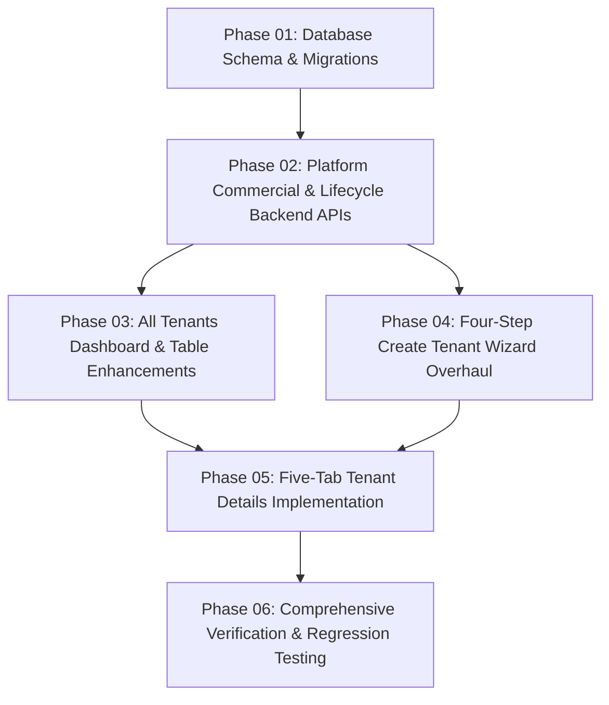

# BEZENT — Tenant Management: Phase 00 Deep Architecture & Readiness Audit

**Document Path:** `docs/architecture/TENANT-MANAGEMENT-AUDIT.md`  
**Status:** Canonical Engineering Audit (Phase 00 Read-Only)  
**Author:** Principal SaaS Architect, Senior Full-Stack Engineer, Database Architect, Security Engineer, QA Lead & UI/UX Reviewer  
**Repository:** `E:\Company\bezent_ecosystem`  
**Governing Authority:** [AGENTS.md](../../AGENTS.md), [ADR-001…018](ADRs.md), [database/RULES.md](../database/RULES.md), [UI-RULES.md](UI-RULES.md)

---

## 1. Executive Summary

This Phase 00 Deep Audit evaluates the readiness of the BEZENT Super Admin Tenant Management subsystem against the finalized, production-grade enterprise requirements. 

### Current System Health & Readiness Score: **62% Ready**
- **Strong & Production-Ready Foundations:**
  - Strict tenant and company isolation boundary (`tenants`, `companies`, `tenant_details`, `memberships`, `tenant_admins`) enforced in schema and backend repositories ([`apps/api/src/db/schema.ts`](file:///E:/Company/bezent_ecosystem/apps/api/src/db/schema.ts#L18-L1425)).
  - Zero-exception platform security guards (`requirePlatformAuth`, `requireSuperAdmin`) guarding all `/api/v1/platform/*` endpoints ([`apps/api/src/platform/auth/middleware/auth.middleware.ts`](file:///E:/Company/bezent_ecosystem/apps/api/src/platform/auth/middleware/auth.middleware.ts#L45-L76)).
  - ADR-018 passwordless authentication via Email OTP challenges; no passwords collected or stored for administrators.
  - Zero application CSS compliance across all Super Admin pages, backed by the unified BEZENT Design System tokens and primitives.
  - Atomic baseline customer provisioning transaction in [`CustomerProvisioningService`](file:///E:/Company/bezent_ecosystem/apps/api/src/platform/provisioning/service/provisioning.service.ts#L128-L238).

### Critical Blockers & Architecture Gaps:
1. **Commercial Subscriptions & Plans are Completely Unmodeled:** There are currently **zero database tables** for plans, tenant subscriptions, billing cycles, seats, or trial periods. The database schema test explicitly asserts that `tenants` does not contain billing/subscription fields ([`apps/api/src/db/__tests__/tenants.test.ts:63-65`](file:///E:/Company/bezent_ecosystem/apps/api/src/db/__tests__/tenants.test.ts#L63-L65)), adhering to architectural separation, but the corresponding commercial tables have not yet been introduced.
2. **Provisioning Job Processing is Monolithic & Synchronous:** Provisioning executes in a single in-process transaction without execution step logging, background queuing, retry mechanisms, or a `provisioning_jobs` audit model.
3. **Primary Admin is Not Designated in Data:** The `tenant_admins` and `memberships` tables store administrative assignments, but neither contains an `is_primary` flag, designation metadata, or atomic reassignment logic.
4. **Create Tenant Wizard Step Mismatch:** The current UI ([`CustomerProvisioningPage.tsx`](file:///E:/Company/bezent_ecosystem/apps/web/src/administration/super-admin/pages/CustomerProvisioningPage.tsx)) uses a 5-step wizard that separates Tenant Identity from Primary Company and enforces mandatory application selection, conflicting with the finalized 4-step wizard requirements where application selection is optional.
5. **Tenant Details Tab Structure Conflict:** The current [`TenantDetailsPage.tsx`](file:///E:/Company/bezent_ecosystem/apps/web/src/administration/super-admin/pages/TenantDetailsPage.tsx) renders tabs `['overview', 'companies', 'applications', 'administrators', 'activity']`, completely missing the required `Provisioning` and `Lifecycle` tabs, while treating `companies` and `administrators` as competing top-level tabs instead of nested overview components.
6. **Lifecycle Management Lacks Audit & Reasons:** The existing suspend and reactivate endpoints ([`apps/api/src/platform/tenants/routes/tenant.routes.ts:14-16`](file:///E:/Company/bezent_ecosystem/apps/api/src/platform/tenants/routes/tenant.routes.ts#L14-L16)) do not accept a reason payload, and there is no `tenant_lifecycle_events` table for history.

---

## 2. Verified Current Architecture

### 2.1 Monorepo & Directory Structure
```
bezent_ecosystem/
├── apps/
│   ├── api/src/
│   │   ├── app/                    # Express application bootstrap & error handling
│   │   ├── db/                     # Drizzle MySQL schema, migrations (0000–0029), seed
│   │   └── platform/               # Modular Platform domain services:
│   │       ├── access/             # Enterprise RBAC catalog & role sync (ADR-017)
│   │       ├── audit/              # Administrative audit logs & secret sanitization
│   │       ├── auth/               # Email OTP challenges, sessions, bearer tokens
│   │       ├── companies/          # Legal entity CRUD & capacity management
│   │       ├── email/              # SMTP & local outbox email transport
│   │       ├── modules/            # Tenant module entitlement ceiling
│   │       ├── provisioning/       # Customer onboarding transaction
│   │       └── tenants/            # Tenant isolation, health engine, capacity
│   └── web/src/
│       ├── administration/
│       │   ├── super-admin/        # Canonical Super Admin workspace implementation
│       │   │   ├── api/            # superAdminApi.ts typed client
│       │   │   ├── navigation/     # superAdminNavigation.ts (8 canonical groups)
│       │   │   ├── pages/          # TenantsPage, CustomerProvisioningPage, TenantDetailsPage
│       │   │   └── routes/         # superAdminRoutes.tsx
│       │   └── tenant-admin/       # Isolated Tenant Admin workspace
│       ├── applications/
│       │   └── super-admin/        # Backward-compatible re-exports
│       ├── design-system/          # Primitives, tokens, zero-CSS layout components
│       └── layouts/app-shell/      # Canonical BEZENT AppShell (LeftSidebar, TopNav)
└── docs/architecture/             # Governed architecture specifications & ADRs
```

### 2.2 Verified Data Model (`apps/api/src/db/schema.ts`)
| Table Name | Primary Key | Key Relationships / Indices | Architectural Purpose | Line Ref |
|---|---|---|---|---|
| `tenants` | `id: varchar(64)` | None (Root Boundary) | Top-level customer account isolation boundary. Enforces `maxCompanies` (default 5) and status (`active`, `inactive`, `suspended`, `archived`). | [L18-29](file:///E:/Company/bezent_ecosystem/apps/api/src/db/schema.ts#L18-L29) |
| `tenant_details` | `tenant_id: varchar(64)` | FK `tenants.id`, Unique index on `code` | Extension table holding customer code, primary contact email, and contact phone. | [L1212-1225](file:///E:/Company/bezent_ecosystem/apps/api/src/db/schema.ts#L1212-L1225) |
| `companies` | `id: varchar(64)` | FK `tenant_id`, Index on `tenant_id`, `code` | Legal and regional entities under a tenant. Holds country, currency, tax number, timezone, address. | [L34-73](file:///E:/Company/bezent_ecosystem/apps/api/src/db/schema.ts#L34-L73) |
| `users` | `id: varchar(64)` | Unique index on `email` | Platform authentication identities (ADR-009: `User ≠ Employee`). Stores passwordless hash/salt, super-admin flag. | [L1234-1254](file:///E:/Company/bezent_ecosystem/apps/api/src/db/schema.ts#L1234-L1254) |
| `memberships` | `id: varchar(64)` | FK `user_id`, FK `company_id`, Unique `(user_id, company_id, role)` | Scoped access granting roles (`company_admin`, `hr_manager`, `employee`, `user`) within a specific company. | [L1263-1284](file:///E:/Company/bezent_ecosystem/apps/api/src/db/schema.ts#L1263-L1284) |
| `tenant_admins` | `id: varchar(64)` | FK `tenant_id`, FK `user_id`, Unique `(tenant_id, user_id)` | Tenant-level administrative authority across all child companies without requiring per-company membership. | [L1295-1315](file:///E:/Company/bezent_ecosystem/apps/api/src/db/schema.ts#L1295-L1315) |
| `tenant_modules` | `id: varchar(64)` | Unique `(tenant_id, company_id, module_code)` | Entitlement ceiling when `company_id IS NULL`; company distribution when `company_id` is set. | [L1555-1576](file:///E:/Company/bezent_ecosystem/apps/api/src/db/schema.ts#L1555-L1576) |
| `audit_logs` | `id: varchar(64)` | Indices on `actor_user_id`, `target_id`, `tenant_id`, `created_at` | Append-only administrative audit trail with actor, action, target, and sanitized JSON metadata. | [L1585-1605](file:///E:/Company/bezent_ecosystem/apps/api/src/db/schema.ts#L1585-L1605) |

### 2.3 Verified Backend Endpoints
- **Tenants:**
  - `GET /api/v1/platform/tenants`: Lists tenants with search, status filter, module filter, customer health evaluation, and setup progress calculation ([`apps/api/src/platform/tenants/routes/tenant.routes.ts:9`](file:///E:/Company/bezent_ecosystem/apps/api/src/platform/tenants/routes/tenant.routes.ts#L9)).
  - `POST /api/v1/platform/tenants`: Raw tenant create ([`tenant.routes.ts:10`](file:///E:/Company/bezent_ecosystem/apps/api/src/platform/tenants/routes/tenant.routes.ts#L10)).
  - `GET /api/v1/platform/tenants/:id`: Full tenant profile by ID ([`tenant.routes.ts:11`](file:///E:/Company/bezent_ecosystem/apps/api/src/platform/tenants/routes/tenant.routes.ts#L11)).
  - `PATCH /api/v1/platform/tenants/:id`: Update tenant name, contact email, contact phone ([`tenant.routes.ts:13`](file:///E:/Company/bezent_ecosystem/apps/api/src/platform/tenants/routes/tenant.routes.ts#L13)).
  - `POST /api/v1/platform/tenants/:id/activate`: Re-activates tenant status to `active` ([`tenant.routes.ts:14`](file:///E:/Company/bezent_ecosystem/apps/api/src/platform/tenants/routes/tenant.routes.ts#L14)).
  - `POST /api/v1/platform/tenants/:id/suspend`: Suspends tenant status to `suspended` ([`tenant.routes.ts:16`](file:///E:/Company/bezent_ecosystem/apps/api/src/platform/tenants/routes/tenant.routes.ts#L16)).
  - `GET/PATCH /api/v1/platform/tenants/:id/company-capacity`: Manages company ceiling ([`tenant.routes.ts:17-19`](file:///E:/Company/bezent_ecosystem/apps/api/src/platform/tenants/routes/tenant.routes.ts#L17-L19)).
- **Provisioning:**
  - `POST /api/v1/platform/provisioning/validate`: Preflight validation checking tenant code conflicts and cross-tenant user re-assignment rules ([`provisioning.routes.ts:9`](file:///E:/Company/bezent_ecosystem/apps/api/src/platform/provisioning/routes/provisioning.routes.ts#L9)).
  - `POST /api/v1/platform/provisioning/provision`: Synchronous atomic provisioning of tenant, tenant details, primary company, module entitlements, admin user, membership, role sync, tenant admin authority, and email invitation ([`provisioning.routes.ts:10`](file:///E:/Company/bezent_ecosystem/apps/api/src/platform/provisioning/routes/provisioning.routes.ts#L10)).

---

## 3. Existing Features That Can Be Reused

1. **Transactional Provisioning Core:** [`CustomerProvisioningService.provisionCustomer`](file:///E:/Company/bezent_ecosystem/apps/api/src/platform/provisioning/service/provisioning.service.ts#L98) already coordinates atomic writes across 7 tables in a single MySQL transaction.
2. **Deterministic Customer Health & Setup Engine:** [`tenantHealth.ts`](file:///E:/Company/bezent_ecosystem/apps/api/src/platform/tenants/service/tenantHealth.ts) evaluates customer attention states (`healthy`, `needs_attention`, `critical`) and setup milestones derived directly from DB state (companies count, modules enabled, admin login recency).
3. **Company Capacity Ceiling Architecture:** [`TenantService.updateCompanyCapacity`](file:///E:/Company/bezent_ecosystem/apps/api/src/platform/tenants/service/tenant.service.ts#L121) prevents reducing capacity below current active company count and logs audit events.
4. **Tenant Entitlement Ceiling Logic:** [`ModuleService.isTenantEntitled`](file:///E:/Company/bezent_ecosystem/apps/api/src/platform/modules/service/module.service.ts#L23) and `evaluateEntitlement` accurately enforce that company module access can only narrow, never expand, the tenant ceiling.
5. **Security & Audit Redaction:** [`AuditService.logEvent`](file:///E:/Company/bezent_ecosystem/apps/api/src/platform/audit/service/audit.service.ts#L44) automatically sanitizes sensitive fields (`password`, `token`, `otp`, `secret`, `cookie`) before persistence.
6. **Passwordless Email OTP Invitation:** [`EmailService.sendSignInInvitation`](file:///E:/Company/bezent_ecosystem/apps/api/src/platform/email/service/email.service.ts#L71) sends clear sign-in instructions pointing to `/login` without collecting passwords.
7. **Design System Primitives:** Full suite of zero-CSS components (`Page`, `PageHeader`, `Section`, `Card`, `Grid`, `Stack`, `Inline`, `Table`, `Badge`, `Button`, `Input`, `Select`, `Switch`, `Modal`, `Tabs`, `Toolbar`, `Alert`) in [`apps/web/src/design-system/components/index.ts`](file:///E:/Company/bezent_ecosystem/apps/web/src/design-system/components/index.ts).

---

## 4. Missing Features

### 4.1 Subscriptions, Plans & Commercial Tiering
- **No Plans Catalog / Table:** Missing database model and API for subscription plans (e.g., Enterprise, Growth, Starter) with associated modules and default seat limits.
- **No Tenant Subscriptions Table:** Missing persistent model linking tenants and companies to active subscriptions, billing cadences (monthly/annual), seat counts, and renewal dates.
- **No Trial vs. Paid Distinction:** Missing `trial_ends_at` tracking and trial lifecycle states.
- **No Entitlement Previews / Usage Limits:** No data structures tracking max active users vs. entitled seats.

### 4.2 Provisioning Job Management
- **No Provisioning Jobs Table:** Missing asynchronous or step-by-step job execution state tracking (`provisioning_jobs` table).
- **No Step Failure Recovery / Retries:** If email sending fails or a partial step fails, there is no UI or API to inspect errors or retry failed steps.
- **No Provisioning History:** No historical audit of customer provisioning runs.

### 4.3 Primary Administrator Designation
- **No `is_primary` Column:** `tenant_admins` has no column indicating which administrator is the designated Primary Admin.
- **No Primary Admin Reassignment Flow:** No safe mechanism to transfer Primary Admin authority to another user with confirmation and audit.
- **No Job Title in User Profile:** The `users` table does not store job title.

### 4.4 Create Tenant Wizard
- **Missing Company Fields in Step 1:** Missing logo upload/selector via media assets, display name, website, industry, company size, full street address (address line 1, address line 2, city, state, postal code), and country-aware business registration numbers (GSTIN, EIN, CRN).
- **Missing Auto-Fill & Duplicate Detection:** Preflight checks only check code uniqueness; they do not check company legal name, tax registration number, or provide domain-based auto-fill.
- **Mandatory Application Trap:** Step 3 enforces at least one application must be selected ([`CustomerProvisioningPage.tsx:82`](file:///E:/Company/bezent_ecosystem/apps/web/src/administration/super-admin/pages/CustomerProvisioningPage.tsx#L82)), whereas the requirement states application selection is optional.

### 4.5 All Tenants Screen
- **Missing Summary Cards:** Missing top metric cards (`Total`, `Active`, `Trial`, `Suspended`).
- **Missing Table Columns:** Missing Primary Administrator, Subscription summary, User count, and Creation Date columns.
- **Missing Pagination & Sorting Controls:** Table is unpaginated on frontend and lacks column header sort triggers.
- **Missing Quick Actions:** No direct action menu shortcuts to "Manage Entitlements", "Provisioning", or "Activity".

### 4.6 Tenant Details Tabs
- **Missing `Provisioning` Tab:** Completely absent from [`TenantDetailsPage.tsx`](file:///E:/Company/bezent_ecosystem/apps/web/src/administration/super-admin/pages/TenantDetailsPage.tsx#L38).
- **Missing `Lifecycle` Tab:** Completely absent; suspend/reactivate is an unadorned modal without reason tracking.
- **Missing True `Entitlements` Tab:** The existing `applications` tab only renders a basic list of application toggles. It lacks plan derivation, usage limits, manual override controls, reconciliation status, and entitlement history.
- **Missing Event Details Drawer & CSV Export:** The `activity` tab only renders a raw table without an inspect drawer or CSV export.

---

## 5. Incorrect or Conflicting Implementations

| # | Current Implementation | Finalized Requirement | Conflict Type | Location |
|---|---|---|---|---|
| 1 | `CustomerProvisioningPage` uses 5 steps: (1) Customer, (2) Primary Company, (3) Applications, (4) Admin, (5) Review | 4-step wizard: (1) Company Information, (2) Primary Administrator, (3) Applications & Subscriptions, (4) Review & Create | Architecture / UX Mismatch | [`CustomerProvisioningPage.tsx:28-91`](file:///E:/Company/bezent_ecosystem/apps/web/src/administration/super-admin/pages/CustomerProvisioningPage.tsx#L28-L91) |
| 2 | Step 3 enforces `canProceedStep3 = enableHrms \|\| enableCrm \|\| enablePm` | Application selection must be optional; customers can be created with 0 applications | Functional Defect | [`CustomerProvisioningPage.tsx:63,82`](file:///E:/Company/bezent_ecosystem/apps/web/src/administration/super-admin/pages/CustomerProvisioningPage.tsx#L63) |
| 3 | `TenantDetailsPage` tabs: `overview`, `companies`, `applications`, `administrators`, `activity` | 5 tabs: `overview`, `entitlements`, `provisioning`, `lifecycle`, `activity` | Information Architecture Violation | [`TenantDetailsPage.tsx:38,367`](file:///E:/Company/bezent_ecosystem/apps/web/src/administration/super-admin/pages/TenantDetailsPage.tsx#L38) |
| 4 | `POST /tenants/:id/suspend` and `POST /tenants/:id/activate` take empty POST body | Suspend and reactivate must accept a required `reason` string and record it in audit and lifecycle logs | Backend API Incomplete | [`tenant.routes.ts:14-16`](file:///E:/Company/bezent_ecosystem/apps/api/src/platform/tenants/routes/tenant.routes.ts#L14-L16) |
| 5 | Wizard finishes by showing an inline success card with a "Return to Dashboard" button | Wizard must display success confirmation and redirect to `Tenant Details → Overview` | Flow / Navigation Mismatch | [`CustomerProvisioningPage.tsx:490-530`](file:///E:/Company/bezent_ecosystem/apps/web/src/administration/super-admin/pages/CustomerProvisioningPage.tsx#L490-L530) |
| 6 | `tenants.status` enum is `['active', 'inactive', 'suspended', 'archived']`; no `trial` status exists | All Tenants summary card and lifecycle requirements require tracking `Trial` status | Data Model Mismatch | [`apps/api/src/db/schema.ts:24`](file:///E:/Company/bezent_ecosystem/apps/api/src/db/schema.ts#L24) |
| 7 | `validatePreflight` rejects any user that has memberships in another tenant | Primary Admin creation requires "Existing identity reuse" across tenants | Authorization Policy Conflict | [`provisioning.service.ts:74-77`](file:///E:/Company/bezent_ecosystem/apps/api/src/platform/provisioning/service/provisioning.service.ts#L74-L77) |

---

## 6. Database / Schema Gaps

### 6.1 Missing & Required Schema Additions
To satisfy the requirements without violating existing invariants or ADRs:

1. **`tenant_admins` Extension:**
   - Add `is_primary` (`boolean`, default `false`, not null).
   - Add `job_title` (`varchar(100)`).
   - Add unique index on `(tenant_id, is_primary)` where `is_primary = true` (or enforce in service layer) to guarantee **exactly one designated Primary Admin per tenant**.

2. **`tenants` Extension:**
   - Add `suspended_reason` (`varchar(1000)`).
   - Add `suspended_at` (`timestamp`).
   - Add `reactivated_at` (`timestamp`).
   - *(Note: Do NOT add billing/plans columns directly to `tenants` table; keep commercial models in separate tables as verified by [`tenants.test.ts:58-68`](file:///E:/Company/bezent_ecosystem/apps/api/src/db/__tests__/tenants.test.ts#L58-L68)).*

3. **New Table: `plans`**
   ```sql
   CREATE TABLE `plans` (
     `id` varchar(64) PRIMARY KEY,
     `code` varchar(50) NOT NULL UNIQUE,
     `name` varchar(100) NOT NULL,
     `module_code` enum('hrms', 'crm', 'project_management') NOT NULL,
     `tier` enum('starter', 'growth', 'enterprise') NOT NULL,
     `default_seats` int NOT NULL DEFAULT 10,
     `status` enum('active', 'deprecated') NOT NULL DEFAULT 'active',
     `features` json,
     `created_at` timestamp NOT NULL DEFAULT (now()),
     `updated_at` timestamp NOT NULL DEFAULT (now()) ON UPDATE CURRENT_TIMESTAMP
   );
   ```

4. **New Table: `tenant_subscriptions`**
   ```sql
   CREATE TABLE `tenant_subscriptions` (
     `id` varchar(64) PRIMARY KEY,
     `tenant_id` varchar(64) NOT NULL REFERENCES `tenants`(`id`),
     `company_id` varchar(64) REFERENCES `companies`(`id`),
     `module_code` enum('hrms', 'crm', 'project_management') NOT NULL,
     `plan_id` varchar(64) REFERENCES `plans`(`id`),
     `status` enum('trial', 'active', 'suspended', 'cancelled', 'expired') NOT NULL DEFAULT 'active',
     `billing_cycle` enum('monthly', 'annual', 'one_time') NOT NULL DEFAULT 'monthly',
     `allocated_seats` int NOT NULL DEFAULT 10,
     `trial_ends_at` timestamp NULL,
     `starts_at` timestamp NOT NULL DEFAULT (now()),
     `renews_at` timestamp NULL,
     `created_at` timestamp NOT NULL DEFAULT (now()),
     `updated_at` timestamp NOT NULL DEFAULT (now()) ON UPDATE CURRENT_TIMESTAMP,
     UNIQUE INDEX `idx_tenant_subscriptions_tenant_mod` (`tenant_id`, `module_code`)
   );
   ```

5. **New Table: `tenant_lifecycle_events`**
   ```sql
   CREATE TABLE `tenant_lifecycle_events` (
     `id` varchar(64) PRIMARY KEY,
     `tenant_id` varchar(64) NOT NULL REFERENCES `tenants`(`id`),
     `event_type` enum('created', 'activated', 'suspended', 'reactivated', 'terminated') NOT NULL,
     `previous_status` varchar(50),
     `new_status` varchar(50) NOT NULL,
     `reason` varchar(1000),
     `actor_user_id` varchar(64),
     `actor_email` varchar(255),
     `metadata` json,
     `created_at` timestamp NOT NULL DEFAULT (now()),
     INDEX `idx_lifecycle_tenant_created` (`tenant_id`, `created_at`)
   );
   ```

6. **New Table: `provisioning_jobs`**
   ```sql
   CREATE TABLE `provisioning_jobs` (
     `id` varchar(64) PRIMARY KEY,
     `tenant_id` varchar(64) NOT NULL REFERENCES `tenants`(`id`),
     `company_id` varchar(64) REFERENCES `companies`(`id`),
     `status` enum('pending', 'in_progress', 'completed', 'failed') NOT NULL DEFAULT 'pending',
     `step_state` json NOT NULL,
     `idempotency_key` varchar(128) UNIQUE,
     `attempts` int NOT NULL DEFAULT 1,
     `last_error` text,
     `created_at` timestamp NOT NULL DEFAULT (now()),
     `updated_at` timestamp NOT NULL DEFAULT (now()) ON UPDATE CURRENT_TIMESTAMP,
     INDEX `idx_prov_jobs_tenant` (`tenant_id`)
   );
   ```

---

## 7. API Gaps

The following backend endpoints must be added or enhanced on `/api/v1/platform/*`:

| Endpoint | Method | Status | Required Request / Response Changes |
|---|---|---|---|
| `/tenants/summary` | `GET` | **Missing** | Returns `{ total: number, active: number, trial: number, suspended: number }` for the 4 top summary cards on All Tenants. |
| `/tenants` | `GET` | **Partially Implemented** | Add query params: `page`, `limit`, `sortBy`, `sortOrder`. Include `primaryAdmin: { name, email }`, `subscriptionSummary: { activeCount, trialCount }`, `userCount`, `createdAt`. |
| `/tenants/:id/suspend` | `POST` | **Requires Changes** | Accept body: `{ reason: string }` (mandatory, min length 5). Record in `tenant_lifecycle_events` and `audit_logs`. |
| `/tenants/:id/reactivate` | `POST` | **Requires Changes** | Accept body: `{ reason?: string }`. Record in `tenant_lifecycle_events` and `audit_logs`. |
| `/tenants/:id/terminate` | `POST` | **Missing** | Protected termination endpoint requiring confirmation token and audit logging. Prevents accidental data deletion. |
| `/tenants/:id/primary-admin` | `PATCH` | **Missing** | Atomically reassigns Primary Administrator from user A to user B with audit logging. |
| `/tenants/:id/subscriptions` | `GET`, `POST`, `PATCH` | **Missing** | Manages independent subscriptions for HRMS, CRM, and PM per tenant. |
| `/tenants/:id/provisioning` | `GET` | **Missing** | Retrieves provisioning execution status, individual step states, and history for the Provisioning tab. |
| `/tenants/:id/provisioning/retry` | `POST` | **Missing** | Retries failed steps (e.g., resends invitation, re-runs company application distribution). |
| `/tenants/:id/lifecycle` | `GET` | **Missing** | Returns chronological list of lifecycle events for the Lifecycle tab. |
| `/tenants/:id/audit-logs/export` | `GET` | **Missing** | Streams authorized CSV export of audit logs for the Activity tab with formula sanitization. |

---

## 8. UI/UX Gaps

### 8.1 All Tenants Screen (`TenantsPage.tsx`)
- **Metric Cards:** Needs 4 summary cards (`Total Tenants`, `Active`, `In Trial`, `Suspended`) at the top of the page using `<Grid columns={4}>` and `<Card>`.
- **Table Data Grid:**
  - Add `Primary Administrator` column (with avatar/initials and email caption).
  - Add `Subscriptions` column (pill badges indicating active modules and plan tier).
  - Add `Users` column showing membership count.
  - Add `Created Date` column formatted using standard date formatting tokens.
- **Table Controls:**
  - Column sorting on `Name`, `Created Date`, `Status`.
  - Pagination controls (`Page X of Y`, Previous/Next buttons, page size selector).
- **Row Actions:** Dropdown or action group with direct navigation to:
  - `View Details` (`/super-admin/tenants/:id`)
  - `Manage Entitlements` (`/super-admin/tenants/:id?tab=entitlements`)
  - `Provisioning Status` (`/super-admin/tenants/:id?tab=provisioning`)
  - `Suspend / Reactivate`

### 8.2 Create Tenant Wizard (`CustomerProvisioningPage.tsx`)
- **Step 1: Company Information (Merged Canonical Primary Company):**
  - Company Legal Name & Display Name.
  - Logo upload preview / asset selector integrating with `mediaAssets`.
  - Business Email, Contact Phone, Website.
  - Industry selector (Manufacturing, Technology, Healthcare, etc.) & Company Size.
  - Address fields: Street Address 1, Street Address 2, City, State/Province, Postal Code, Country, Timezone.
  - Optional country-aware registration identifiers (e.g., GSTIN for India, EIN for US, CRN for UK).
  - Client-side auto-fill: derive Tenant Display Name & Code suggestion from Company Name.
  - Duplicate detection banner if code or company registration number already exists.
- **Step 2: Primary Administrator:**
  - First Name, Last Name, Email Address, Phone Number, Job Title.
  - Radio/switch: Create New User vs. Assign Existing Identity (by email/ID).
  - Clear notice: *"Passwordless Account: A secure invitation will be emailed to this administrator with sign-in instructions via Email OTP. No password is required or collected."*
  - Explicit badge: **Designated Primary Administrator**.
- **Step 3: Applications & Subscriptions:**
  - Independent card selectors for **HRMS**, **CRM**, and **Project Management**.
  - Application selection is optional (all can be deselected).
  - For each selected application:
    - Plan tier selector (Starter, Growth, Enterprise).
    - Access mode: Paid vs. 30-Day Trial.
    - Billing frequency: Monthly vs. Annual.
    - Seat allocation input (numeric).
    - Entitlement preview box showing entitled module capabilities.
  - Activation timing toggle: **Activate Immediately** vs. **Scheduled Activation Date**.
- **Step 4: Review & Create:**
  - Structured summary cards for Company Information, Primary Administrator, and Subscriptions.
  - Edit links jumping back to respective steps.
  - Persistent state: if backend validation fails, wizard retains all entered values.
  - Idempotency key generated per wizard submission to prevent double-click duplicate creation.
  - On success: Modal confirmation followed by redirect directly to `/super-admin/tenants/:newTenantId`.

### 8.3 Tenant Details Screen (`TenantDetailsPage.tsx`)
Restructure tabs into exactly 5:
1. **Overview:**
   - 4 Top Metric Cards (Status, Companies, Active Subscriptions, Total Users).
   - Card: Primary Company Information (Legal name, address, tax registration, contact).
   - Card: Primary Administrator Profile (Name, email, phone, job title, last login, Reassign button).
   - Card: Applications & Subscriptions Summary.
   - Card: Tenant Isolation & Security Summary (Tenant ID, code, isolation mode, session policies).
   - Card: Customer Health & Attention Required (from `evaluateCustomerHealth`).
   - Card: Setup Progress Milestones (from `evaluateSetupProgress`).
2. **Entitlements:**
   - Application selector dropdown/tabs.
   - Plan-derived module and feature entitlement matrix.
   - Seat usage vs. allocation progress bar.
   - Super Admin Manual Override controls with reason capture.
   - Entitlement Reconciliation Status (indicates if company entitlements match tenant plan).
   - Entitlement history log.
3. **Provisioning:**
   - Provisioning Status summary (Completed / Failed / In Progress).
   - Visual step execution timeline: (1) Tenant Boundary, (2) Company Setup, (3) Subscription Allocation, (4) Primary Admin Assignment, (5) Sign-in Invitation Emailed.
   - Error alert box with technical details if failed.
   - Authorized **"Retry Failed Steps"** button.
   - Provisioning history records.
4. **Lifecycle:**
   - Status badge and lifecycle dates (Created At, Last Status Change At).
   - **Suspend Tenant** button opening modal with mandatory Reason field.
   - **Reactivate Tenant** button with reason capture.
   - **Protected Termination** action with confirmation phrase input.
   - Chronological Lifecycle Event History table.
   - Clear policy callout: *"Suspending or cancelling subscriptions never deletes underlying company data."*
5. **Activity:**
   - Filterable Audit Logs table (Action, Actor, Target, Date).
   - Search bar and action filter dropdown.
   - **Event Details Drawer:** Clicking a row opens a slide-over panel displaying the full metadata JSON payload with formatted key-value pairs.
   - **Export CSV:** Secure button to download audit logs as CSV.

---

## 9. Security and Tenant Isolation Risks

1. **User Identity Reuse Across Tenants (ADR-009 Invariant):**
   - In BEZENT, `users` is a global identity table (`users.email` is globally unique).
   - When reusing an existing user as the Primary Admin of a new tenant, the system must **only** create a new `tenant_admins` record and `memberships` record for the new tenant.
   - **Risk:** Existing code in [`provisioning.service.ts:74`](file:///E:/Company/bezent_ecosystem/apps/api/src/platform/provisioning/service/provisioning.service.ts#L74) rejects users who belong to another tenant. This must be replaced with safe identity reuse: validating that the user exists and attaching them to the new tenant without modifying their existing passwords, credentials, or other tenant memberships.
2. **Exactly One Primary Admin Invariant:**
   - If a tenant has multiple tenant admins, ambiguity arises regarding legal ownership, billing contacts, and root escalation.
   - **Enforcement:** Enforce atomic transactions during reassignment: clearing `is_primary = true` on the old admin and setting it on the new admin within the same MySQL transaction.
3. **Audit Log Formula Injection (CSV Injection):**
   - When exporting audit logs to CSV, fields containing `=`, `+`, `-`, or `@` at the start of cells must be prefixed with an apostrophe `'` to prevent spreadsheet formula execution vulnerabilities.
4. **Data Retention Invariant on Suspension / Termination:**
   - Suspending a tenant sets `tenants.status = 'suspended'`, which instantly causes [`moduleService.isTenantEntitled`](file:///E:/Company/bezent_ecosystem/apps/api/src/platform/modules/service/module.service.ts#L25) and [`auth.middleware.ts`](file:///E:/Company/bezent_ecosystem/apps/api/src/platform/auth/middleware/auth.middleware.ts#L83) to deny all employee/admin operations across that tenant's companies.
   - **Critical Rule:** Never issue `DELETE FROM companies` or `DELETE FROM employees` upon tenant suspension or subscription cancellation. Data must remain frozen and preserved until legal retention periods elapse.
5. **Platform Super Admin Privilege Verification:**
   - Every single backend route for tenant management, subscriptions, entitlements, provisioning, and lifecycle must continue to enforce `requirePlatformAuth` and `requireSuperAdmin`.

---

## 10. Requirement Traceability Matrix

| Requirement | Scope | Status | Code / Test Evidence | Notes / Gaps |
|---|---|---|---|---|
| **Navigation: Tenants → All Tenants** | Sidebar | **Implemented and verified** | [`superAdminNavigation.ts:33`](file:///E:/Company/bezent_ecosystem/apps/web/src/administration/super-admin/navigation/superAdminNavigation.ts#L33), tests pass | Route `/super-admin/tenants` |
| **Navigation: Tenants → Create Tenant** | Sidebar | **Implemented and verified** | [`superAdminNavigation.ts:38`](file:///E:/Company/bezent_ecosystem/apps/web/src/administration/super-admin/navigation/superAdminNavigation.ts#L38), tests pass | Route `/super-admin/tenants/create` & `/super-admin/provisioning` |
| **Navigation: Tenants → Tenant Details** | Sidebar | **Implemented and verified** | [`superAdminNavigation.ts:43`](file:///E:/Company/bezent_ecosystem/apps/web/src/administration/super-admin/navigation/superAdminNavigation.ts#L43), tests pass | Deep link `/super-admin/tenants/:tenantId` |
| **All Tenants: Summary Cards** | UI | **Missing** | [`TenantsPage.tsx:174-263`](file:///E:/Company/bezent_ecosystem/apps/web/src/administration/super-admin/pages/TenantsPage.tsx#L174-L263) | Missing Total, Active, Trial, Suspended cards |
| **All Tenants: Search & Filters** | UI & API | **Implemented and verified** | [`TenantsPage.tsx:201-236`](file:///E:/Company/bezent_ecosystem/apps/web/src/administration/super-admin/pages/TenantsPage.tsx#L201-L236), [`tenant.repository.ts:282-313`](file:///E:/Company/bezent_ecosystem/apps/api/src/platform/tenants/repository/tenant.repository.ts#L282-L313) | Search, status, module, attention filters work |
| **All Tenants: Pagination & Sorting** | UI & API | **Partially implemented** | API has `limit`/`offset` ([`tenant.repository.ts:279`](file:///E:/Company/bezent_ecosystem/apps/api/src/platform/tenants/repository/tenant.repository.ts#L279)); UI does not pass page controls | UI missing page selector & column sort |
| **All Tenants: Complete Table Columns** | UI | **Partially implemented** | Has Name, Companies, Modules, Health, Status. Missing Primary Admin, Subscriptions, Users, Created Date | Column set incomplete |
| **All Tenants: Action Shortcuts** | UI | **Partially implemented** | Has Edit, Suspend/Reactivate. Missing Entitlements, Provisioning, Activity links | Action menu needs enrichment |
| **Create Wizard: Step 1 Company Info** | UI & Backend | **Partially implemented** | Basic name/code/legalName in [`provisioning.service.ts:149`](file:///E:/Company/bezent_ecosystem/apps/api/src/platform/provisioning/service/provisioning.service.ts#L149) | Missing logo, address lines, industry, size, tax IDs, duplicate check |
| **Create Wizard: Step 2 Primary Admin** | UI & Backend | **Partially implemented** | User + Membership + TenantAdmin in [`provisioning.service.ts:198-238`](file:///E:/Company/bezent_ecosystem/apps/api/src/platform/provisioning/service/provisioning.service.ts#L198-L238) | Missing job title, `is_primary` flag, cross-tenant identity reuse |
| **Create Wizard: Step 3 Subscriptions** | UI & Backend | **Missing** | Only raw module toggles in [`provisioning.service.ts:162`](file:///E:/Company/bezent_ecosystem/apps/api/src/platform/provisioning/service/provisioning.service.ts#L162) | Missing plans, trial/paid, seats, scheduled activation; mandatory app block |
| **Create Wizard: Step 4 Review & Create** | UI | **Partially implemented** | Has review in [`CustomerProvisioningPage.tsx:390`](file:///E:/Company/bezent_ecosystem/apps/web/src/administration/super-admin/pages/CustomerProvisioningPage.tsx#L390) | Missing redirect to Tenant Details, idempotency token, wizard state preservation |
| **Tenant Details: 5 Tabs Architecture** | UI | **Conflicting** | [`TenantDetailsPage.tsx:38`](file:///E:/Company/bezent_ecosystem/apps/web/src/administration/super-admin/pages/TenantDetailsPage.tsx#L38) has `['overview', 'companies', 'applications', 'administrators', 'activity']` | Missing Provisioning & Lifecycle tabs; extra conflicting tabs |
| **Tenant Details: Overview Tab Sections** | UI | **Partially implemented** | Has metrics, attention, health, setup progress in [`TenantDetailsPage.tsx:377-500`](file:///E:/Company/bezent_ecosystem/apps/web/src/administration/super-admin/pages/TenantDetailsPage.tsx#L377-L500) | Missing dedicated Company Info, Primary Admin, and Subscriptions cards |
| **Tenant Details: Entitlements Tab** | UI & Backend | **Partially implemented** | Has raw enable/disable in `applications` tab | Missing plan derivation, seat usage limits, overrides, reconciliation status |
| **Tenant Details: Provisioning Tab** | UI & Backend | **Missing** | No provisioning tab in UI, no `provisioning_jobs` in backend | Complete gap |
| **Tenant Details: Lifecycle Tab** | UI & Backend | **Missing** | Basic suspend/activate endpoints without reason payload | Missing reason capture, history log, protected termination |
| **Tenant Details: Activity Tab Drawer & CSV** | UI & Backend | **Partially implemented** | Raw audit table in [`TenantDetailsPage.tsx:770`](file:///E:/Company/bezent_ecosystem/apps/web/src/administration/super-admin/pages/TenantDetailsPage.tsx#L770) | Missing Event Details Drawer and CSV export |

---

## 11. Prioritized Implementation Phases



### Phase 01: Database Schema & Migrations (Additive & Safe)
- Add Drizzle schema and migrations:
  - `plans` table (Starter, Growth, Enterprise per module).
  - `tenant_subscriptions` table (Tenant/Company, plan, status, seats, billing cycle, trial dates).
  - `tenant_lifecycle_events` table (Audit timeline of status changes).
  - `provisioning_jobs` table (Step-by-step execution tracking and error logs).
  - Add `is_primary` and `job_title` to `tenant_admins`.
  - Add `suspended_reason`, `suspended_at`, `reactivated_at` to `tenants`.
- Verify migrations against offline tests and ensure existing applied migrations (`0000` to `0029`) are untouched.

### Phase 02: Platform Commercial & Lifecycle Backend APIs
- Implement `SubscriptionService` & `PlanService`: catalog, subscription assignment, seat limits.
- Implement `LifecycleService`: suspend/reactivate with mandatory reason, lifecycle history, protected termination.
- Implement `ProvisioningJobService`: execution step logging, retry handler, idempotency checks.
- Enhance `tenant.service.ts` to return summary card metrics (`total`, `active`, `trial`, `suspended`).
- Update `CustomerProvisioningService` to support optional applications, identity reuse without tenant conflicts, and Primary Admin designation.
- Add audit log CSV stream export with formula injection sanitization.

### Phase 03: All Tenants UI Upgrade
- Add 4 top summary cards (`Total`, `Active`, `Trial`, `Suspended`).
- Implement table pagination and sorting.
- Add columns: `Primary Admin`, `Subscriptions`, `Users`, `Created Date`.
- Enrich row action menu with direct links to Entitlements, Provisioning, and Activity.

### Phase 04: Four-Step Create Tenant Wizard Overhaul
- Refactor `CustomerProvisioningPage.tsx` into strict 4-step wizard:
  - **Step 1:** Company Information (legal/display name, logo, address, industry, registration numbers, duplicate check).
  - **Step 2:** Primary Administrator (name, email, phone, job title, identity reuse, Primary Admin badge).
  - **Step 3:** Applications & Subscriptions (optional apps, plan tiers, paid/trial, seat counts, scheduled activation).
  - **Step 4:** Review & Create (idempotent submission, failure data preservation, redirect to Tenant Details).

### Phase 05: Five-Tab Tenant Details Overhaul
- Refactor `TenantDetailsPage.tsx` tabs to:
  - **Overview:** 4 metrics cards, Company Information, Primary Admin (with reassign action), Subscriptions, Security, Attention, Setup Progress.
  - **Entitlements:** App selector, plan derivation, seat limits, Super Admin manual overrides, reconciliation status.
  - **Provisioning:** Status badge, execution step timeline, error alert, retry button.
  - **Lifecycle:** Status badge, timeline, Suspend modal (with required reason), Reactivate modal, Termination guard.
  - **Activity:** Searchable audit log table, Event Details Drawer, CSV Export.

### Phase 06: Comprehensive Verification & Regression Testing
- Execute targeted unit, integration, and E2E tests for all negative cases, permissions, and isolation boundaries.
- Verify zero application CSS and full TypeScript typecheck.

---

## 12. Exact Files Likely to Require Changes

### Backend Files
| File Path | Action | Rationale |
|---|---|---|
| [`apps/api/src/db/schema.ts`](file:///E:/Company/bezent_ecosystem/apps/api/src/db/schema.ts) | Modify | Add `plans`, `tenant_subscriptions`, `tenant_lifecycle_events`, `provisioning_jobs` tables; extend `tenant_admins` and `tenants`. |
| `apps/api/src/db/migrations/0030_tenant_management_v1.sql` | Create | DDL migration for new tables and column additions. |
| [`apps/api/src/db/seed.ts`](file:///E:/Company/bezent_ecosystem/apps/api/src/db/seed.ts) | Modify | Seed default commercial plans (Starter, Growth, Enterprise for HRMS, CRM, PM) and seed existing demo subscriptions. |
| `apps/api/src/platform/subscriptions/*` | Create | Subscription controller, service, repository, validation, routes. |
| [`apps/api/src/platform/tenants/service/tenant.service.ts`](file:///E:/Company/bezent_ecosystem/apps/api/src/platform/tenants/service/tenant.service.ts) | Modify | Add summary metrics, suspend with reason, reactivate with reason, lifecycle logging. |
| [`apps/api/src/platform/tenants/repository/tenant.repository.ts`](file:///E:/Company/bezent_ecosystem/apps/api/src/platform/tenants/repository/tenant.repository.ts) | Modify | Include Primary Admin, subscription summaries, and sorting/pagination in `list`. |
| [`apps/api/src/platform/tenants/routes/tenant.routes.ts`](file:///E:/Company/bezent_ecosystem/apps/api/src/platform/tenants/routes/tenant.routes.ts) | Modify | Add `/summary`, `/lifecycle`, `/primary-admin`, `/terminate` routes. |
| [`apps/api/src/platform/provisioning/service/provisioning.service.ts`](file:///E:/Company/bezent_ecosystem/apps/api/src/platform/provisioning/service/provisioning.service.ts) | Modify | Support optional applications, record provisioning job steps, assign `is_primary` admin, allow cross-tenant identity reuse. |
| [`apps/api/src/platform/audit/routes/audit.routes.ts`](file:///E:/Company/bezent_ecosystem/apps/api/src/platform/audit/routes/audit.routes.ts) | Modify | Add `/audit-logs/export` CSV endpoint with formula injection protection. |
| [`apps/api/src/platform/routes.ts`](file:///E:/Company/bezent_ecosystem/apps/api/src/platform/routes.ts) | Modify | Mount new subscription and lifecycle routers under `platformRouter`. |

### Frontend Files
| File Path | Action | Rationale |
|---|---|---|
| [`apps/web/src/administration/super-admin/api/superAdminApi.ts`](file:///E:/Company/bezent_ecosystem/apps/web/src/administration/super-admin/api/superAdminApi.ts) | Modify | Add typed API methods for tenant summary, subscriptions, lifecycle, provisioning retry, audit CSV export. |
| [`apps/web/src/administration/super-admin/pages/TenantsPage.tsx`](file:///E:/Company/bezent_ecosystem/apps/web/src/administration/super-admin/pages/TenantsPage.tsx) | Modify | Add 4 summary cards, full table columns, pagination, and enriched action menus. |
| [`apps/web/src/administration/super-admin/pages/CustomerProvisioningPage.tsx`](file:///E:/Company/bezent_ecosystem/apps/web/src/administration/super-admin/pages/CustomerProvisioningPage.tsx) | Overhaul | Transform to 4-step wizard: Company Info, Primary Admin, Optional Subscriptions, Review & Redirect. |
| [`apps/web/src/administration/super-admin/pages/TenantDetailsPage.tsx`](file:///E:/Company/bezent_ecosystem/apps/web/src/administration/super-admin/pages/TenantDetailsPage.tsx) | Overhaul | Restructure to 5 tabs: Overview, Entitlements, Provisioning, Lifecycle, Activity (with Drawer & CSV). |
| `apps/web/src/administration/super-admin/components/*` | Create | Modular tab components: `TenantOverviewTab`, `TenantEntitlementsTab`, `TenantProvisioningTab`, `TenantLifecycleTab`, `EventDetailsDrawer`. |

---

## 13. Migration and Backward-Compatibility Plan

1. **Non-Destructive DDL Migration:**
   - The new migration `0030_tenant_management_v1.sql` introduces strictly new tables (`plans`, `tenant_subscriptions`, `tenant_lifecycle_events`, `provisioning_jobs`) and nullable or defaulted columns (`tenant_admins.is_primary`, `tenants.suspended_reason`).
   - Existing data in `tenants`, `companies`, `users`, `memberships`, `tenant_admins`, and `tenant_modules` remains completely intact.
2. **Backfill Migration for Existing Tenants:**
   - Existing tenants in the database (e.g. `tenant_demo_01`, `tnt_apjc3d_01`):
     - Designate the earliest created active tenant admin as `is_primary = true`.
     - Synthesize default active subscriptions in `tenant_subscriptions` matching their existing `tenant_modules` enabled records.
     - Generate an initial `tenant_lifecycle_events` record with `event_type = 'created'`.
3. **Compatibility Invariant for Module Entitlement Ceiling:**
   - [`ModuleService.isTenantEntitled`](file:///E:/Company/bezent_ecosystem/apps/api/src/platform/modules/service/module.service.ts#L23) continues to read from `tenant_modules`. When `tenant_subscriptions` is updated, the service will synchronize `tenant_modules` automatically, ensuring all downstream applications (HRMS, CRM, PM) and Tenant Admin components continue working without modification.

---

## 14. Test Coverage Plan

### 14.1 Unit & Integration Test Suites
- `apps/api/src/platform/__tests__/subscriptions.test.ts`: Verify plan creation, subscription lifecycle, and seat constraints.
- `apps/api/src/platform/__tests__/tenantLifecycle.test.ts`: Verify suspend with reason, reactivate with reason, termination safeguards, and timeline logging.
- `apps/api/src/platform/__tests__/provisioningJobs.test.ts`: Verify step logging, failure capture, and retry handling.
- `apps/api/src/platform/__tests__/primaryAdmin.test.ts`: Verify single Primary Admin constraint and atomic reassignment.
- `apps/web/src/administration/super-admin/__tests__/allTenantsUI.test.tsx`: Verify 4 summary cards, table columns, pagination, and sorting.
- `apps/web/src/administration/super-admin/__tests__/createTenantWizard.test.tsx`: Verify 4-step wizard, optional applications, duplicate check, and redirect.
- `apps/web/src/administration/super-admin/__tests__/tenantDetailsTabs.test.tsx`: Verify all 5 tabs, drawers, and actions.

### 14.2 Negative & Edge Test Cases
1. **Duplicate Tenant Code:** Reject with `409 ConflictError` on duplicate code or registration number.
2. **Same Email Across Tenants:** When creating a tenant with an existing email, verify the user account is safely reused as Primary Admin without altering their credentials or removing their existing company memberships in other tenants.
3. **Zero Application Provisioning:** Verify wizard succeeds when all applications are deselected, establishing tenant ceiling with 0 enabled modules.
4. **Invalid Seat Count:** Reject subscription creations with negative or non-integer seat counts.
5. **Scheduled Activation:** Verify tenant is created with `suspended` or `inactive` status if activation date is in the future.
6. **Failed Invitation Delivery:** If email sending fails, verify the provisioning job records `INVITATION_EMAIL_FAILED`, preserves the tenant and company, and allows manual retry from the Provisioning tab.
7. **Cross-Tenant Data Tampering:** Verify non-Super Admin users receive `403 Forbidden` on all tenant management and subscription routes.
8. **Concurrent Primary Admin Reassignment:** Verify race conditions on Primary Admin reassignment are resolved deterministically with exactly one `is_primary = true` admin remaining.
9. **Suspend Without Reason:** Verify `PATCH /tenants/:id/suspend` returns `400 BadRequestError` if `reason` is missing or empty.
10. **CSV Injection Prevention:** Verify audit export prefixes cells starting with `=`, `+`, `-`, or `@` with `'`.

---

## 15. Risks, Blockers and Unresolved Decisions

| Item | Type | Analysis & Recommendation |
|---|---|---|
| **Commercial Billing Engine** | Decision | Are plans and billing managed strictly as administrative metadata within BEZENT, or is a live payment gateway (Stripe/Razorpay) expected? **Recommendation:** Implement fully functional internal SaaS subscription management (plans, tiers, billing cycle, seat limits) with webhook hooks ready for external payment providers. |
| **Trial Status Representation** | Architectural Decision | Should `Trial` be a new value on `tenants.status` or derived from `tenant_subscriptions.status`? **Recommendation:** Keep `tenants.status` as tenant isolation boundary (`active`, `suspended`, `archived`) and derive `Trial` from active subscriptions with `status = 'trial'` and valid `trial_ends_at`. This prevents conflating the customer tenant isolation boundary with commercial billing state. |
| **Job Queue Technology** | Dependency Risk | Does Phase 01 require Redis / BullMQ, or is a MySQL transactional job table sufficient? **Recommendation:** Use a reliable MySQL `provisioning_jobs` table and transactional outbox. This avoids introducing a new external infrastructure dependency (Redis) ahead of concrete scale needs, preserving the modular monolith architecture. |

---

## Final Output & Sign-Off

### Existing System Readiness
The repository already contains the core multi-tenant security architecture, database foundations, and zero-CSS design system required to build an enterprise-grade Tenant Management system. However, commercial subscriptions, job-based provisioning, lifecycle reason tracking, and the revised 4-step wizard / 5-tab details UI must be systematically implemented.

### Critical Blockers Before Implementation
- Approval of the additive database migration plan (`0030_tenant_management_v1.sql`).
- Approval of the 4-step wizard restructuring and 5-tab Tenant Details information architecture.
- Alignment on internal commercial subscription metadata versus external billing integration.

### Recommended Architecture
Follow the modular layered architecture:
`routes → controller → service → repository → database (Drizzle)`
Maintain strict separation between:
- Tenant Isolation Boundary (`tenants`, `companies`)
- Identity & Access (`users`, `memberships`, `tenant_admins`)
- Commercial Subscriptions (`plans`, `tenant_subscriptions`)
- Reliability & Operations (`provisioning_jobs`, `tenant_lifecycle_events`, `audit_logs`)

### Safe Implementation Order
1. **Phase 01:** Additive Drizzle schema migration (`0030_...`) & unit tests.
2. **Phase 02:** Backend services: Subscriptions, Lifecycle with reasons, Provisioning Jobs, Audit CSV export.
3. **Phase 03:** All Tenants screen: 4 summary cards, full columns, pagination, sorting.
4. **Phase 04:** Create Tenant 4-step wizard overhaul with optional apps and redirect.
5. **Phase 05:** Tenant Details 5-tab overhaul (Overview, Entitlements, Provisioning, Lifecycle, Activity).
6. **Phase 06:** Full regression verification (0 failures across all workspaces).

### Exact Next Actions
**STOP for user review.** Await explicit review and approval of this Phase 00 Deep Audit report before beginning implementation.
