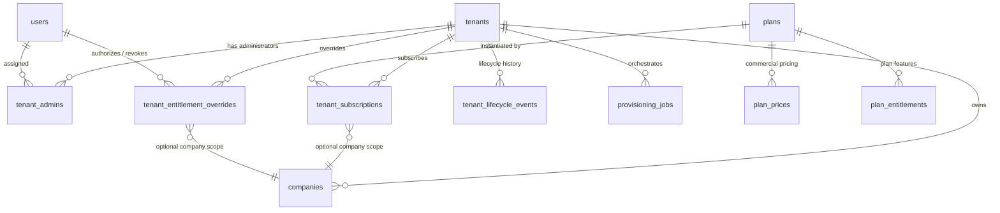

# BEZENT — Tenant Management Phase 01: Production-Grade Database Foundation

> **Document Status:** Authoritative & Approved  
> **Phase:** Phase 01 (Database Architecture, Drizzle Schema, Migrations, Constraints, Backfill, Persistence Tests)  
> **Architecture Compliance:** Fully compliant with [AGENTS.md](../../AGENTS.md), ADR-001 through ADR-018, and MySQL 8.0/8.4 engine invariants.

---

## 1. Verified Starting State

Prior to modifying code, a deep audit ([TENANT-MANAGEMENT-AUDIT.md](./TENANT-MANAGEMENT-AUDIT.md)) and pre-implementation inspection confirmed the following baseline:
- **Database Engine:** MySQL 8.4 on InnoDB (`bezent_dev`).
- **ORM & Migrations:** Drizzle ORM `^0.45.2` and Drizzle-Kit `^0.30.1`.
- **Existing Migrations:** Applied through `0029_media_branding_foundation.sql`. Migration `0030_tenant_management_v1` was determined as the authoritative, available sequence identifier.
- **Identity & Organization Models:** 
  - `User ≠ Employee` strictly maintained (ADR-009).
  - Platform `tenant_admins` established in Phase 2 with explicit tenant-level authority.
  - Multi-tenant boundary: `tenants` and tenant-scoped `companies`.
  - Application module ceiling: `tenant_modules` (HRMS, CRM, PM).
- **Critical MySQL Discovery:** Adding a `STORED` generated column to an existing table referencing foreign keys (`tenant_admins` referencing `tenants` and `users`) triggers MySQL `Error 1215: ER_CANNOT_ADD_FOREIGN` during online alter. Defining the column as `VIRTUAL` with a secondary `UNIQUE INDEX` allows online schema evolution without table rebuilds, while providing physical uniqueness enforcement.

---

## 2. Approved Architecture Decisions & Invariants

1. **Internal SaaS Commercial Billing Model (Option A):**
   - Implemented catalog storage for Applications, Subscription Plans, Commercial Prices, and Plan Entitlements.
   - Decoupled commercial prices from technical entitlements.
   - Minor currency integer units (e.g. cents/paise) to prevent floating-point calculation drift.
   - Preserved boundaries for future billing gateways (Stripe/Razorpay) without leaking gateway-specific dependencies into Phase 01.
2. **Tenant Creation & State Decoupling:**
   - A tenant can be initialized with zero subscriptions or applications without violating tenancy boundaries.
   - Application selection is optional; pending setup does not invalidate tenant isolation.
3. **Primary Administrator Invariant:**
   - Designed a safe MySQL-compatible constraint supporting **exactly one active Primary Admin per initialized tenant** while permitting **multiple non-primary tenant admins**.
   - Implemented via a `VIRTUAL` generated column:
     ```sql
     primary_tenant_scope varchar(64) GENERATED ALWAYS AS (
       IF(is_primary = 1 AND status = 'active', tenant_id, NULL)
     ) VIRTUAL
     ```
     backed by `UNIQUE INDEX idx_tenant_admins_single_primary (primary_tenant_scope)`.
   - In MySQL, `NULL` values in unique indexes do not conflict with each other. All non-primary admins evaluate to `NULL`, allowing multiple non-primary admins, while any second `is_primary = 1 AND status = 'active'` row generates the same `tenant_id` and is rejected by the database engine.
4. **Subscription History & Conflicting Active Subscription Prevention:**
   - Preserves full commercial renewal, cancellation, and upgrade history.
   - Prevents conflicting simultaneously active subscriptions via an active scope generated column:
     ```sql
     active_subscription_scope varchar(128) GENERATED ALWAYS AS (
       CASE WHEN status IN ('active', 'trial', 'pending_activation') 
            THEN CONCAT(tenant_id, ':', application_code) 
            ELSE NULL END
     ) STORED
     ```
     backed by `UNIQUE INDEX idx_tenant_subscriptions_active_scope`.
   - Historical rows (`cancelled`, `expired`, `suspended`, `past_due`) evaluate to `NULL`, allowing unlimited historical records per `(tenant_id, application_code)` while physically guaranteeing at most one currently active subscription.
5. **Auditable Entitlement Overrides:**
   - Time-bounded, authorized overrides with explicit revocation metadata (`revoked_at`, `revoked_by_user_id`, `revocation_reason`).
   - Maintains full compatibility with the existing `tenant_modules` ceiling.
6. **Transactional Outbox & Provisioning Jobs:**
   - Implemented persistent job execution tracking with idempotency keys and retry metadata.
   - Outbox table for atomic event emission within business transactions.

---

## 3. Entity Relationship Specification



---

## 4. New and Modified Schema Objects

### A. Modified Existing Tables

#### 1. `tenants`
- `suspended_reason` (`varchar(1000)` nullable): Reason recorded during tenant suspension.
- `suspended_at` (`timestamp` nullable): Timestamp of suspension.
- `reactivated_at` (`timestamp` nullable): Timestamp of latest reactivation.

#### 2. `tenant_admins`
- `is_primary` (`boolean` default `false` not null): Flags the designated Primary Admin.
- `job_title` (`varchar(100)` nullable): Professional title.
- `primary_tenant_scope` (`varchar(64)` virtual generated column): Evaluates to `tenant_id` only when `is_primary = 1 AND status = 'active'`.
- `UNIQUE INDEX idx_tenant_admins_single_primary (primary_tenant_scope)`.

#### 3. `invitations`
- `authority_type` (`enum('tenant_admin', 'company_role')` default `'company_role'` not null): Discriminator for invitation scope.
- `is_primary_admin` (`boolean` default `false` not null): Designates invitation for primary admin role.

### B. New Tables

#### 1. `plans`
- **Purpose:** Commercial application subscription plans (Starter, Growth, Enterprise).
- **Columns:** `id`, `application_code`, `code`, `name`, `description`, `tier`, `status`, `version`, `default_seats`, `min_seats`, `max_seats`, `trial_eligible`, `trial_duration_days`, `is_custom`, `created_at`, `updated_at`.
- **Constraints:** `PRIMARY KEY (id)`, `UNIQUE KEY idx_plans_app_code (application_code, code)`.
- **Indexes:** `idx_plans_app_status (application_code, status)`.

#### 2. `plan_prices`
- **Purpose:** Minor currency pricing definitions per interval and currency.
- **Columns:** `id`, `plan_id`, `currency`, `billing_interval`, `amount_minor_units`, `effective_from`, `effective_to`, `status`, `created_at`, `updated_at`.
- **Constraints:** `PRIMARY KEY (id)`, `FOREIGN KEY (plan_id) REFERENCES plans(id)`.
- **Indexes:** `idx_plan_prices_plan_curr_interval (plan_id, currency, billing_interval, status)`.

#### 3. `plan_entitlements`
- **Purpose:** Module and feature limits derived from plan definitions.
- **Columns:** `id`, `plan_id`, `application_code`, `module_code`, `is_enabled`, `limits` (JSON), `created_at`, `updated_at`.
- **Constraints:** `PRIMARY KEY (id)`, `UNIQUE KEY idx_plan_entitlements_plan_mod (plan_id, module_code)`, `FOREIGN KEY (plan_id) REFERENCES plans(id)`.
- **Indexes:** `idx_plan_entitlements_app (application_code)`.

#### 4. `tenant_subscriptions`
- **Purpose:** Active and historical commercial subscriptions per tenant and application.
- **Columns:** `id`, `tenant_id`, `company_id`, `application_code`, `plan_id`, `status`, `access_mode`, `billing_cycle`, `licensed_seats`, `scheduled_activation_at`, `activated_at`, `trial_starts_at`, `trial_ends_at`, `current_period_starts_at`, `current_period_ends_at`, `cancelled_at`, `cancellation_reason`, `renews_at`, `auto_renew`, `version`, `active_subscription_scope`, `created_at`, `updated_at`.
- **Constraints:** `PRIMARY KEY (id)`, `UNIQUE KEY idx_tenant_subscriptions_active_scope (active_subscription_scope)`, `FOREIGN KEY (tenant_id) REFERENCES tenants(id)`, `FOREIGN KEY (company_id) REFERENCES companies(id)`, `FOREIGN KEY (plan_id) REFERENCES plans(id)`.
- **Indexes:** `idx_tenant_subscriptions_tenant_app (tenant_id, application_code)`, `idx_tenant_subscriptions_plan (plan_id)`, `idx_tenant_subscriptions_status (status)`.

#### 5. `tenant_entitlement_overrides`
- **Purpose:** Auditable, time-bounded Super Admin capability overrides.
- **Columns:** `id`, `tenant_id`, `company_id`, `application_code`, `module_code`, `override_type`, `override_value` (JSON), `reason`, `authorized_by_user_id`, `valid_from`, `valid_until`, `revoked_at`, `revoked_by_user_id`, `revocation_reason`, `created_at`, `updated_at`.
- **Constraints:** `PRIMARY KEY (id)`, `FOREIGN KEY (tenant_id) REFERENCES tenants(id)`, `FOREIGN KEY (company_id) REFERENCES companies(id)`, `FOREIGN KEY (authorized_by_user_id) REFERENCES users(id)`, `FOREIGN KEY (revoked_by_user_id) REFERENCES users(id)`.
- **Indexes:** `idx_entitlement_overrides_tenant_mod (tenant_id, application_code, module_code)`, `idx_entitlement_overrides_valid (tenant_id, valid_until)`.

#### 6. `tenant_lifecycle_events`
- **Purpose:** Append-only history of tenant lifecycle events.
- **Columns:** `id`, `tenant_id`, `event_type`, `previous_status`, `new_status`, `reason`, `actor_user_id`, `actor_email`, `metadata` (JSON), `created_at`.
- **Constraints:** `PRIMARY KEY (id)`, `FOREIGN KEY (tenant_id) REFERENCES tenants(id)`, `FOREIGN KEY (actor_user_id) REFERENCES users(id)`.
- **Indexes:** `idx_lifecycle_tenant_created (tenant_id, created_at)`, `idx_lifecycle_event_type (event_type)`.

#### 7. `provisioning_jobs`
- **Purpose:** Persistent step-by-step state tracking for customer onboarding and asynchronous retries.
- **Columns:** `id`, `tenant_id`, `company_id`, `job_type`, `status`, `idempotency_key`, `attempt_count`, `max_attempts`, `retry_eligible`, `next_attempt_at`, `step_state` (JSON), `error_code`, `last_error`, `worker_id`, `started_at`, `completed_at`, `created_at`, `updated_at`.
- **Constraints:** `PRIMARY KEY (id)`, `UNIQUE KEY idx_prov_jobs_idempotency (idempotency_key)`, `FOREIGN KEY (tenant_id) REFERENCES tenants(id)`, `FOREIGN KEY (company_id) REFERENCES companies(id)`.
- **Indexes:** `idx_prov_jobs_tenant (tenant_id)`, `idx_prov_jobs_status (status)`.

#### 8. `transactional_outbox`
- **Purpose:** Reliable, at-least-once business event publishing post-commit.
- **Columns:** `id`, `aggregate_type`, `aggregate_id`, `event_type`, `payload` (JSON), `idempotency_key`, `status`, `attempt_count`, `max_attempts`, `next_attempt_at`, `last_error`, `published_at`, `created_at`, `updated_at`.
- **Constraints:** `PRIMARY KEY (id)`, `UNIQUE KEY idx_outbox_idempotency (idempotency_key)`.
- **Indexes:** `idx_outbox_status_next (status, next_attempt_at)`, `idx_outbox_aggregate (aggregate_type, aggregate_id)`.

---

## 5. Migration Files & Synchronization

- **Migration File:** `apps/api/src/db/migrations/0030_tenant_management_v1.sql`
- **Journal File:** `apps/api/src/db/migrations/meta/_journal.json` (tag: `0030_tenant_management_v1`, idx: `30`)
- **Snapshot File:** `apps/api/src/db/migrations/meta/0030_snapshot.json`
- **Drizzle Kit Check:** `npx drizzle-kit generate` returns:
  `No schema changes, nothing to migrate 😴` (100% schema-to-migration parity).

---

## 6. Backfill Strategy & Dry-Run Report

The backfill utility (`apps/api/src/platform/tenants/backfill/tenantManagementBackfill.service.ts`) implements conservative, non-destructive classification:
1. **Never manufactures commercial facts:** Does not fabricate paid subscriptions or guess pricing for legacy tenants.
2. **Never invents Primary Admins arbitrarily:** Only tenants with strictly one active administrator receive automatic designation.
3. **Preserves existing data:** All `companies` (50 records) and `tenant_modules` (40 records) remain intact.
4. **Dry-Run Capability:** Run via `npx tsx src/platform/tenants/backfill/runBackfill.ts --dry-run`.

### Live Baseline Execution Results:
- **Total Non-Archived Tenants Evaluated:** 35
- **Already Configured Primary Admins:** 1 (`tenant_demo_01` -> `usr_ta_bezent_01`)
- **Safe Automatic Designations:** 9 (tenants with exactly 1 active administrator)
- **Requires Business Confirmation:** 1 (`tent_p2de_main`, which has 2 active administrators: `usr_p2de_ta1`, `usr_p2de_ta2`)
- **Requires Manual Reconciliation:** 24 (tenants with 0 active administrators, e.g. unprovisioned accounts or test fixtures)
- **Preserved Companies:** 50
- **Preserved Tenant Module Entitlements:** 40

---

## 7. Test Verification & Zero Regression Evidence

### A. Dedicated Persistence Test Suite
**Command:** `npx vitest run src/platform/__tests__/tenantManagementPhase01Persistence.test.ts`
- **Suite:** `Tenant Management Phase 01 Database Foundation — Persistence & Invariants`
- **Test Results:** 16 passed (100%), 0 failed, 0 skipped
- **Coverage Areas:**
  - Plan code uniqueness per application scope
  - Minor currency integer amounts without floating-point representations
  - Plan entitlement structured limit definitions and uniqueness
  - Multiple non-primary tenant admins in the same tenant
  - Physical enforcement of at most one active Primary Admin per tenant
  - Atomic Primary Administrator reassignment
  - Simultaneous active subscription prevention across identical applications
  - Subscription history retention across cancellations and upgrades
  - Scheduled activation and trial metadata persistence
  - Auditable time-bounded overrides and revocation metadata
  - Provisioning job idempotency key uniqueness
  - Transactional outbox event idempotency key uniqueness
  - Provisioning job retry and step state updates
  - Transactional outbox status transition (`pending` -> `published`)
  - Global user identity reuse across tenants without credential mutation
  - Compatibility with legacy `tenant_modules` entitlement ceiling

### B. Full Backend Test Suite
**Command:** `npm test --workspace=apps/api`
- **Test Files:** 57 passed (57/57)
- **Total Tests:** 857 passed (857/857)
- **Regressions:** 0
- **Key Subsystems Re-verified:**
  - Email OTP authentication challenges (ADR-018)
  - Super Admin authorization and tenant provisioning
  - Tenant Admin authorization, members, and invitations (Phase 2)
  - Company Admin multi-company access and isolation
  - HRMS Workforce, Organization, Locations, Departments, Job Levels, and Grades
  - Onboarding dynamic stages and settings lifecycle

### C. TypeScript Typechecks
- `npm run typecheck --workspace=apps/api`: **0 errors** (`tsc -p tsconfig.json --noEmit` exited with code 0).
- `npm run typecheck --workspace=apps/web`: **0 errors** (`tsc -b --noEmit` exited with code 0).

---

## 8. Requirement Traceability Matrix

| Requirement | Code Location | Migration DDL | Test Evidence |
| :--- | :--- | :--- | :--- |
| **Application Catalog** | `schema.ts:1600` (`plans.applicationCode`) | `0030_tenant_management_v1.sql:3` | `tenantManagementPhase01Persistence.test.ts:89` |
| **Subscription Plans** | `schema.ts:1600` (`plans`) | `0030_tenant_management_v1.sql:1-20` | `tenantManagementPhase01Persistence.test.ts:89` |
| **Plan Prices (Minor units)** | `schema.ts:1633` (`planPrices`) | `0030_tenant_management_v1.sql:24-37` | `tenantManagementPhase01Persistence.test.ts:128` |
| **Plan Entitlements** | `schema.ts:1669` (`planEntitlements`) | `0030_tenant_management_v1.sql:41-53` | `tenantManagementPhase01Persistence.test.ts:160` |
| **Tenant Subscriptions** | `schema.ts:1701` (`tenantSubscriptions`) | `0030_tenant_management_v1.sql:57-86` | `tenantManagementPhase01Persistence.test.ts:258` |
| **Active Sub Conflict Prevention** | `schema.ts:1745` (`activeSubscriptionScope`) | `0030_tenant_management_v1.sql:78,82` | `tenantManagementPhase01Persistence.test.ts:275` |
| **Subscription History** | `schema.ts:1740` (`cancelledAt`, `status`) | `0030_tenant_management_v1.sql:63,73` | `tenantManagementPhase01Persistence.test.ts:303` |
| **Entitlement Overrides** | `schema.ts:1767` (`tenantEntitlementOverrides`) | `0030_tenant_management_v1.sql:94-116` | `tenantManagementPhase01Persistence.test.ts:358` |
| **Single Primary Admin** | `schema.ts:1312` (`primaryTenantScope`) | `0030_tenant_management_v1.sql:204,206` | `tenantManagementPhase01Persistence.test.ts:219` |
| **Multiple Non-Primary Admins** | `schema.ts:1310` (`isPrimary`) | `0030_tenant_management_v1.sql:200` | `tenantManagementPhase01Persistence.test.ts:197` |
| **Tenant Lifecycle History** | `schema.ts:1817` (`tenantLifecycleEvents`) | `0030_tenant_management_v1.sql:122-136` | `seed.ts:1011` |
| **Provisioning Jobs & Idempotency** | `schema.ts:1849` (`provisioningJobs`) | `0030_tenant_management_v1.sql:142-165` | `tenantManagementPhase01Persistence.test.ts:399` |
| **Transactional Outbox** | `schema.ts:1894` (`transactionalOutbox`) | `0030_tenant_management_v1.sql:171-188` | `tenantManagementPhase01Persistence.test.ts:424` |
| **Zero Data Loss / Migration Safety**| Additive DDL only | `0030_tenant_management_v1.sql` | `db:seed`, Full test suite (857 tests) |
| **Backfill Classification** | `tenantManagementBackfill.service.ts` | Non-destructive dry-run | `tenantManagementPhase01Persistence.test.ts:515` |

---

## 9. Rollback & Restore Strategy

If rollback of Phase 01 DDL is ever required:
1. **Drop New Tables in Dependency Order:**
   ```sql
   DROP TABLE IF EXISTS `transactional_outbox`;
   DROP TABLE IF EXISTS `provisioning_jobs`;
   DROP TABLE IF EXISTS `tenant_lifecycle_events`;
   DROP TABLE IF EXISTS `tenant_entitlement_overrides`;
   DROP TABLE IF EXISTS `tenant_subscriptions`;
   DROP TABLE IF EXISTS `plan_entitlements`;
   DROP TABLE IF EXISTS `plan_prices`;
   DROP TABLE IF EXISTS `plans`;
   ```
2. **Revert Table Alterations:**
   ```sql
   DROP INDEX `idx_tenant_admins_single_primary` ON `tenant_admins`;
   ALTER TABLE `tenant_admins` DROP COLUMN `primary_tenant_scope`;
   ALTER TABLE `tenant_admins` DROP COLUMN `job_title`;
   ALTER TABLE `tenant_admins` DROP COLUMN `is_primary`;
   ALTER TABLE `invitations` DROP COLUMN `is_primary_admin`;
   ALTER TABLE `invitations` DROP COLUMN `authority_type`;
   ALTER TABLE `tenants` DROP COLUMN `reactivated_at`;
   ALTER TABLE `tenants` DROP COLUMN `suspended_at`;
   ALTER TABLE `tenants` DROP COLUMN `suspended_reason`;
   ```
3. **Delete Migration Record:**
   ```sql
   DELETE FROM `__drizzle_migrations` WHERE `id` = 31;
   ```

---

## 10. Deferred Phase 02 Work

The following items are deliberately out of scope for Phase 01 and prepared for Phase 02 implementation:
1. **Super Admin Tenant Management Service & Endpoints:** CRUD controllers, service orchestration, validation schemas for tenant creation wizard.
2. **Four-Step Creation Wizard UI & Five-Tab Tenant Details UI:** Super Admin front-end workflows.
3. **Asynchronous Provisioning Worker Runtime:** Queue worker to process `provisioning_jobs` and dispatch steps.
4. **Outbox Message Dispatcher:** Background process polling `transactional_outbox` and publishing events.
5. **Subscription Upgrade/Downgrade Business Logic:** Proration and seat adjustment business services.

---

## 11. Completion Gate Checklist

- [x] All approved schema additions implemented in `apps/api/src/db/schema.ts`.
- [x] Migration `0030_tenant_management_v1.sql` generated, verified, and synchronized with Drizzle journal and snapshot.
- [x] `drizzle-kit generate` reports zero diffs.
- [x] Primary Admin uniqueness design operates safely under real MySQL engine rules.
- [x] Commercial subscription lifecycle supports history while physically preventing duplicate active rows.
- [x] No manufactured production prices or invented paid subscriptions.
- [x] Existing `tenant_modules` ceiling and multi-tenant isolation preserved.
- [x] Backfill utility implemented with classification reporting and idempotent dry-run capability.
- [x] 16 dedicated persistence tests pass.
- [x] 857 backend unit and integration tests pass (100%).
- [x] TypeScript typechecks pass cleanly on both `apps/api` and `apps/web`.
- [x] Canonical documentation published to `docs/architecture/TENANT-MANAGEMENT-PHASE-01.md`.
